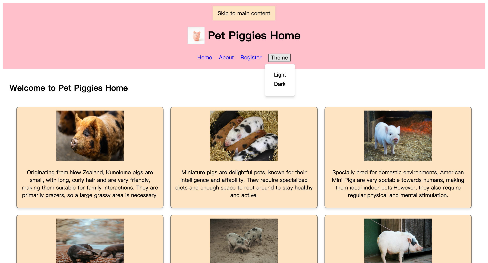
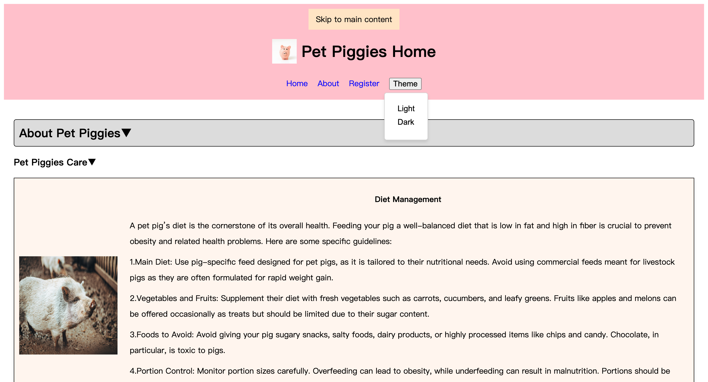
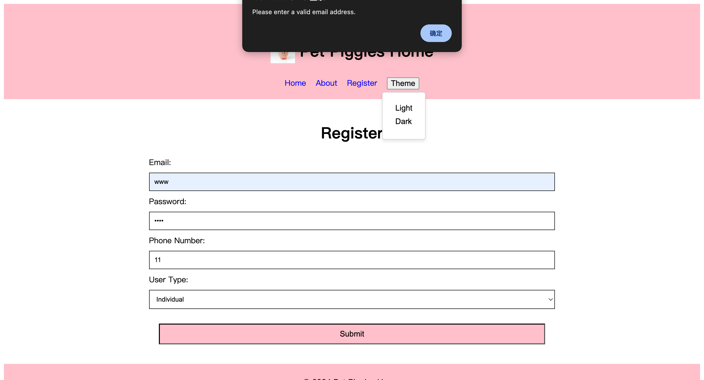

# pet_piggy-s_home (Web page for pet pigs)

Pet Piggies Home is an interactive and responsive web application showcasing various pet pig breeds. This project is built using HTML, CSS, JavaScript, and React, integrating dynamic effects to enhance the user experience.

🚀 Features
	•	Navigation Bar: Includes links to Home, About, and Register pages.
	•	Theme Toggle: Users can switch between light and dark modes dynamically.
	•	Accessible Design: “Skip to main content” button for better accessibility.
	•	Dynamic Content: Each pig breed card is displayed with animations.
	•	Responsive Layout: Works seamlessly on different screen sizes.
    •   Click Logo to Home – Clicking the site logo redirects users to the homepage.

    🛠️ Technologies Used
	•	HTML: Structure and layout of the web pages.
	•	CSS: Styling and responsiveness.
	•	JavaScript: Enhancing interactivity.
	•	React: Component-based UI and state management.

🔗 Accordion Menu Functionality
	•	The “About Pet Piggies” and “Pet Piggies Care” sections use an accordion menu.
	•	Users can click on a section header to expand/collapse its content.
	•	This improves readability and keeps the page organized.

🚀 Page Overview

This is the Pet Piggies Home registration page, built using HTML, CSS, JavaScript, and React. It includes input validation to ensure users provide correct registration details.

🌟 Key Features

✔ Real-time input monitoring – The system checks input correctness as the user types.
✔ Email format validation – Ensures the email is in the correct format before submission.
✔ Required field check – Prevents submission if essential fields are empty.
✔ Dynamic error alerts – Displays alerts when invalid input is detected.
✔ Responsive design – Optimized for different screen sizes.

🔍 Input Validation Rules

📌 Email format – Must follow the pattern example@domain.com, otherwise an error is shown.
📌 Password – Must contain at least 4 characters.
📌 Phone number – Only numeric input is allowed.
📌 User type – Must select Individual or Business.

📜 Installation & Running the Project
	1.	Clone the repository:
    git clone https://github.com/ChengchengGou/pet_piggy-s_home.git
    cd pet_piggies_home

    2.  Make sure your computer has installed:
	•	Node.js and npm
    To check if they are installed, run the following commands:
     node -v  
     npm -v   
    
    3.	Install dependencies:
    npm install

    4.	Start the development server:
    npm run dev

